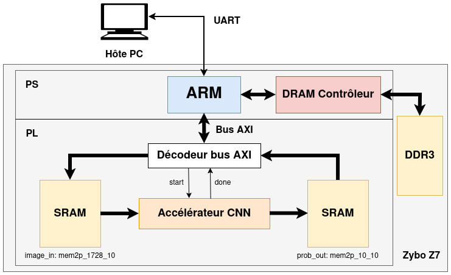
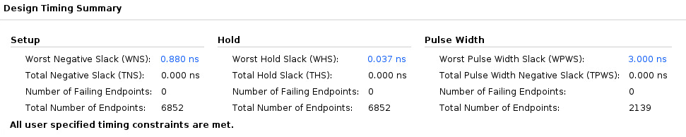

# System-On-Chip (SoC) Integration Project

The main objective of this project is to design and implement a complete hardware (HW) and software (SW) processing system to execute a Convolutional Neural Network (CNN). The final deliverable is a functional implementation on a Xilinx FPGA board (Zybo Z7-20) that integrates hardware acceleration for real-time image classification on the CIFAR-10 dataset.

This project covers the full design cycle:
1. **Algorithmic Development**: Python reference model and C++ fixed-point translation.
2. **HLS Optimization**: Transition from C++ to optimized RTL using Mentor Catapult HLS.
3. **SoC Integration**: Hardware/Software co-design in Vivado and Vitis.
4. **Validation**: Real-time testing via UART with a dedicated Python tool.

## CNN Architecture

```
Input: 24×24×3 RGB image
  ↓
Conv1 (3×3, 64 filters) + ReLU → 24×24×64
  ↓
MaxPool (3×3, stride 2) → 12×12×64
  ↓
Conv2 (3×3, 32 filters) + ReLU → 12×12×32
  ↓
MaxPool (3×3, stride 2) → 6×6×32
  ↓
Conv3 (3×3, 20 filters) + ReLU → 6×6×20
  ↓
MaxPool (3×3, stride 2) → 3×3×20
  ↓
Flatten → 180 features
  ↓
Fully Connected (180x10)
  ↓
Softmax → 10 class probabilities
```

## System Architecture

<p align="center">
  
</p>

The architecture follows a classic HW/SW co-design pattern:
- **Processing System (PS)**: An ARM Cortex-A9 processor running a C++ application that manages data transfers, UART communication with the host, and orchestrates the hardware accelerator.
- **Programmable Logic (PL)**:
  - **CNN Accelerator**: A custom IP core synthesized from HLS C++.
  - **Memory Subsystem**: Dual-port BRAMs for image input (24x24x3) and class probability outputs (10 classes).
  - **Control**: AXI-Lite interface for triggering the start signal and monitoring the 'done' state.

## The CIFAR-10 Dataset

**Source:** [https://www.cs.toronto.edu/~kriz/cifar.html](https://www.cs.toronto.edu/~kriz/cifar.html)

60,000 32×32 color images in 10 classes (6,000 per class):
- Airplane, Automobile, Bird, Cat, Deer
- Dog, Frog, Horse, Ship, Truck

## Project Structure

- `hls/`: Catapult HLS source code and directives
- `fpga/`: Vivado project files and hardware netlists
- `src/`: C++ source code for CNN accelerator
- `model/`: Python reference implementation
- `tools/`: UART streaming, code generation, and validation scripts
- `dataset/`: CIFAR-10 dataset and weight files

## Quick Setup

1. Download CIFAR-10 (Python and binary version):
```bash
wget -P dataset https://www.cs.toronto.edu/~kriz/cifar-10-python.tar.gz https://www.cs.toronto.edu/~kriz/cifar-10-binary.tar.gz

tar -xzvf dataset/cifar-10-python.tar.gz -C dataset
tar -xzvf dataset/cifar-10-binary.tar.gz -C dataset

rm dataset/cifar-10-python.tar.gz dataset/cifar-10-binary.tar.gz
```
2. Install Python dependencies:

```bash
pip install -r requirements.txt
```
3. Source the environment setup script for EDA tools:

```bash
source config/bash_mentor_24
source config/bash_vivado_20
```

## Quick Start

### Build and Run

1. To run the Python reference CNN model:

```bash
python model/cnn_ref.py [options]
```

**Options:**
| Option | Description | Default |
|--------|-------------|---------|
| `-k`, `--kernel` | Kernel size: `3` (3x3), `5` (5x5), or `both` | `3` |
| `-n`, `--num_images` | Number of images to test | `1000` |
| `-d`, `--dataset` | Path to CIFAR-10 batch file | `dataset/cifar-10-batches-py/test_batch` |
| `--weights_3x3` | Path to 3x3 kernel weights file | `dataset/CNN_coeff_3x3.txt` |
| `--weights_5x5` | Path to 5x5 kernel weights file | `dataset/CNN_coeff_5x5.txt` |
| `-c`, `--confusion` | Show confusion matrix analysis | `false` |

**Example:**
```bash
python model/cnn_ref.py -k 3 -n 1000 -c
```

2. To run the C++ implementation:

```bash
make rebuild

# floating point 
./bin/cnn_ref "dataset/cifar-10-batches-bin/test_batch.bin" 1000

# fixed point
./bin/cnn_fixed "dataset/cifar-10-batches-bin/test_batch.bin" 1000
```

**Arguments:**
| Argument | Description | Default |
|----------|-------------|---------|
| `arg1` | Path to CIFAR-10 binary batch file | `dataset/cifar-10-batches-bin/data_batch_1.bin` |
| `arg2` | Number of images to test | `1000` |

**Example:**
```bash
./bin/cnn_ref "dataset/cifar-10-batches-bin/test_batch.bin" 100
```

3. For noise error comparison of floating-point and fixed-point implementation:

```bash
./bin/cnn_scverify
```

## HLS Workflow (Mentor Catapult)

The core of the acceleration is the `cnn_hardware_opt` IP. We explored two implementation strategies located in `hls/Catapult_CNN`:

### 1. Baseline Implementation (`directives_cnn.tcl`)
- **Clock Period**: 20ns (50MHz)
- **Latency**: ~3.8 million cycles

**Run baseline synthesis:**
```bash
cd hls
catapult -f directives_cnn.tcl
```

### 2. Optimized Implementation (`directives_cnn_opt.tcl`)
- **Latency**: ~1.7 million cycles
- **Performance Gain**: **~2.3x speedup** compared to the baseline

**Run optimized synthesis:**
```bash
cd hls
catapult -f directives_cnn_opt.tcl
```

### Simulation & Verification
Functional verification was performed using SCVerify:
- **C++ Simulation**: Verification of fixed-point accuracy against floating-point reference
- **RTL Simulation**: Bit-accurate simulation of the synthesized hardware using Questasim
- Run the simulation by running directives_sim.tcl


## Vivado/Vitis Design Flow

### Vivado Block Design
1. **IP Export**: The optimized RTL from Catapult was exported as an EDF netlist (`cnn_hardware_opt.edf`)
2. **Project Location**:
```bash
cd fpga/CNN_HW_SW/Z7_ProcHDMI_axi_20
vivado Z7_ProcHDMI_axi_20.xpr
```
3. **Synthesis and Implementation**: The design was synthesized and implemented to ensure timing closure at 50MHz (20ns clock period). 

<p align="center">
  
</p>

4. **Export of hardware XSA**: Export of the hardware description in XSA format from the project

### Vitis IDE
1. **Development of software application**: 
   - Load image data batch from UART to DDR3
   - Load image to PL-side BRAM
   - Run the CNN accelerator
   - Read the result from PL-side BRAM
   - Find the maximum probability
   - Output results via UART
2. **Update of the hardware platform**: Update hardware specification and build the project 
3. **Update of the software platform**: Build the project and launch on hardware
4. **Output results via UART**: Run minicom on terminal to view the results
```bash
minicom -D /dev/ttyUSB1
```

## Hardware Testing via UART

We developed a testing tool to stream images from the PC to the FPGA via UART. In another terminal:

```bash
# Send 100 images from the CIFAR-10 test batch via UART
python3 tools/send_ppm_uart.py /dev/ttyUSB1 --binary dataset/cifar-10-batches-bin/test_batch.bin --count 100

# Send specific images with labels
python3 tools/send_ppm_uart.py /dev/ttyUSB1 image1.ppm:0 image2.ppm:3
```